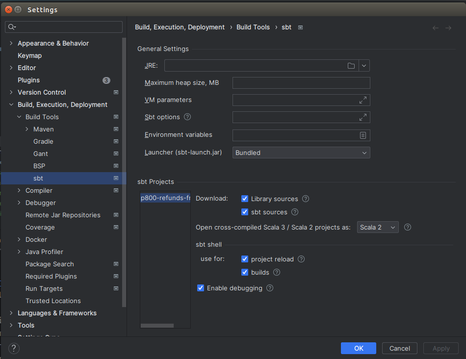

# agent-registration-risking

This service handles the risking element of an agent registration made through agent-registration-frontend.

API
---

| *Task*                                                                     | *Supported Methods* | *Description*                                                                                       |
|----------------------------------------------------------------------------|---------------------|-----------------------------------------------------------------------------------------------------|
| ```/agent-registration-risking/submit-for-risking```                       | POST                | Submit a completed applicaton for risking. [More...](docs/submitForRisking.md)                      |
| ```/agent-registration-risking/application/:applicationReference```        | GET                 | Get the application for the given reference. [More...](docs/getApplication.md)                      |
| ```/agent-registration-risking/individual/:personReference```              | GET                 | Get the individual for the given reference. [More...](docs/getIndividual.md)                        |
| ```/agent-registration-risking/application-status/:applicationReference``` | GET                 | Get the application risking status for the given reference. [More...](docs/getApplicationStatus.md) |

# Running the Service

To start the service, use the following commands:

- `sbt runTestOnly` - this enables extra test endpoints
- `sbt run` to launch the service normally.

Ensure that all dependent applications, including MongoDB and other microservices, are also running.
See https://github.com/hmrc/agent-registration-frontend for that.

# Project Setup in IntelliJ

When importing a project into IntelliJ IDEA, it is recommended to configure your setup as follows to optimize the
development process:

1. **SBT Shell Integration**: Utilize the sbt shell for project reloads and builds. This integration automates project
   discovery and reduces issues when running individual tests from the IDE.

2. **Enable Debugging**: Ensure that the "Enable debugging" option is selected. This allows you to set breakpoints and
   use the debugger to troubleshoot and fine-tune your code.

3. **Library and SBT Sources**: For those working on SBT project definitions, make sure to include "library sources"
   and "sbt sources." These settings enhance code navigation and comprehension by providing access to the underlying SBT
   and library code.

Here is a visual guide to assist you in setting up:


## Project specific sbt commands

### Turn off strict building

In sbt command in intellij:

```
sbt> relax
```

This will turn off strict building for this sbt session.
When you restart it, or you build on jenkins, this will be turned on.

### Run with test only endpoints

```
sbt> runTestOnly
```

### Run tests before check in

```
sbt> clean test
```

# Local Risking Results processing Test

`scripts/local-risking-test.sh` manually verifies the full results-file processing pipeline locally,
without needing SDES or a real risking provider.

### Prerequisites

All of the following must be running before executing the script:

| Service | How to start | Port |
|---------|--------------|------|
| `agent-registration-risking` | `sbt -Dapplication.router=testOnlyDoNotUseInAppConf.Routes run` | `22203` |
| `secure-data-exchange-list-files-stubs` | `sbt -Dhttp.port=8765 run` (from that repo) | `8765` |
| object-store stub | `sm2 --start OBJECT_STORE_STUB` | `8464` |
| MongoDB | running locally | `27017` |

Command-line tools required: `mongosh`, `python3`, `curl` — install with `brew install mongosh python`.

### Running

```
./scripts/local-risking-test.sh
```

The script will seed a valid application into MongoDB, write a risking results file, serve it locally,
trigger the service to download and process it, then verify the application status in MongoDB.

To test failure scenarios, edit the `failures` array in Step 4 of the script. Valid `reasonCode`/`checkId`
combinations are defined in `app/uk/gov/hmrc/agentregistrationrisking/model/Failure.scala` (`FailureParser`).

NOTE: The script bypasses the subsequent call to the risking provider, so it does not test the full end-to-end flow. It is intended to verify the results processing logic in isolation, without needing SDES or a real risking provider.

### License

This code is open source software licensed under
the [Apache 2.0 License]("http://www.apache.org/licenses/LICENSE-2.0.html").