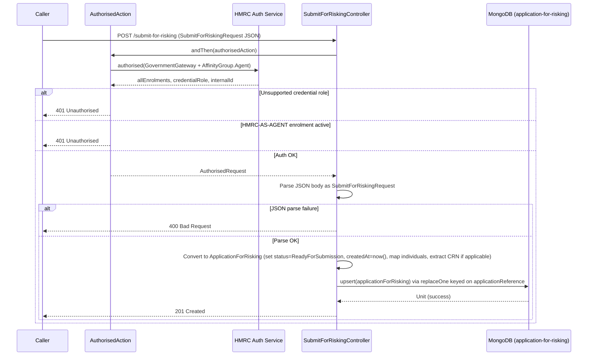

# ARR01 — Submit For Risking

## Overview

Submits a completed agent registration payload for risking assessment. This endpoint accepts a `SubmitForRiskingRequest` JSON body containing the agent application details and associated individuals, transforms the data into an `ApplicationForRisking` document, and upserts it into MongoDB. The record is initially stored with status `ReadyForSubmission` and will be picked up by the background `RiskingRunner` process for file upload to HMRC Object Store / SDES.

## API Details

| Property | Value |
|---|---|
| **API ID** | ARR01 |
| **Method** | POST |
| **Path** | `/submit-for-risking` |
| **Controller** | `SubmitForRiskingController` |
| **Controller Method** | `submitForRisking()` |
| **Audience** | Internal |
| **Authentication** | Government Gateway (Agent, User/Admin credential role) |

## Path Parameters

None.

## Query Parameters

None.

## Request Body

Content-Type: `application/json`

The body must be a valid `SubmitForRiskingRequest`:

```json
{
  "agentApplication": { ... },
  "individuals": [ ... ]
}
```

The `agentApplication` field contains the full agent registration application (business type, applicant details, AMLS details, etc.). The `individuals` field is a list of `IndividualProvidedDetails` objects.

## Response

| Status | Description |
|---|---|
| `201 Created` | Application for risking successfully upserted. Empty response body. |
| `400 Bad Request` | JSON body failed to parse as `SubmitForRiskingRequest`. |
| `401 Unauthorised` | Authentication failed — invalid Government Gateway credentials, wrong affinity group, unsupported credential role, or HMRC-AS-AGENT enrolment already active. |

## Service Architecture

The controller depends on:

- **`Actions`** — provides the `authorised` action builder which chains `DefaultActionBuilder` with `AuthorisedAction`.
- **`AuthorisedAction`** — validates Government Gateway auth, checks affinity group is Agent, retrieves enrolments/credentialRole/internalId, rejects if HMRC-AS-AGENT is already active.
- **`ApplicationForRiskingRepo`** — MongoDB repository for `ApplicationForRisking` documents in the `application-for-risking` collection.

## Interaction Flow



## Dependencies

| Dependency | Type | Purpose |
|---|---|---|
| HMRC Auth Service | External HTTP | Government Gateway authentication and enrolment retrieval |
| MongoDB (`application-for-risking`) | Database | Persist `ApplicationForRisking` documents |

## Database Collections

### `application-for-risking`

- **Operation:** `upsert` (MongoDB `replaceOne` with `upsert=true`)
- **Key field:** `applicationReference`
- **Indexes:**
  - `applicationReference` — unique index
  - `individuals.personReference` — unique index
  - `lastUpdated` — TTL index (configurable retention)

## Special Cases

- **CRN extraction:** CRN is only populated for `LimitedCompany`, `LimitedPartnership`, `LLP`, and `ScottishLimitedPartnership` business types. All other business types receive a `null` CRN.
- **PassedIV requirement:** The `passedIV` field on each `IndividualProvidedDetails` is mandatory. If missing, the method throws an `ExpectedDataMissingException`.
- **Upsert semantics:** Re-submitting the same `applicationReference` overwrites the existing record. This allows callers to correct and resubmit.
- **Individuals provided by applicant flag:** Currently hardcoded to `false` — the system does not support applicant-provided individual details.

## Error Handling

| Scenario | Behaviour |
|---|---|
| JSON body malformed | Play framework returns `400 Bad Request` before controller logic executes |
| Auth failure | `AuthorisedAction` returns `401 Unauthorised` |
| `passedIV` missing on individual | Runtime exception thrown; results in `500 Internal Server Error` |
| MongoDB write failure | Future fails; results in `500 Internal Server Error` |

## Performance Considerations

- This is a write-heavy endpoint. Upsert operations on MongoDB should be fast given the unique index on `applicationReference`.
- Large `individuals` lists will increase document size and upsert time.
- TTL index on `lastUpdated` provides automatic data cleanup.

## Notes

- The `applicationReference` is derived from `agentApplicationId` of the submitted agent application.
- After submission, the record stays in `ReadyForSubmission` status until the `RiskingRunner` background process picks it up and uploads it to Object Store for SDES.
- This endpoint is consumed by the agent registration orchestration service as part of the registration journey completion step.

## Document Metadata

| Property | Value |
|---|---|
| **Last Updated** | 2026-03-27 |
| **Git Commit SHA** | `169b806fc80ac3b3ff2f69c831f3dd6627378da0` |
| **Analysis Version** | 1.0 |
