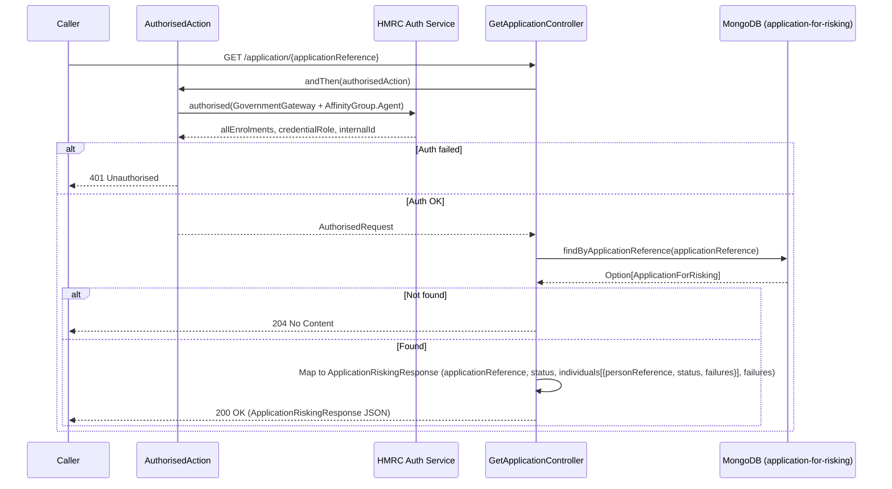

# ARR02 — Get Application Risking Response

## Overview

Retrieves the full risking response for a given application reference. Returns the application's current risking status along with the risking status and any failure details for each associated individual. This endpoint is used by upstream services to poll for the outcome of a submitted risking application.

## API Details

| Property | Value |
|---|---|
| **API ID** | ARR02 |
| **Method** | GET |
| **Path** | `/application/{applicationReference}` |
| **Controller** | `GetApplicationController` |
| **Controller Method** | `getApplicationRiskingResponse(applicationReference: ApplicationReference)` |
| **Audience** | Internal |
| **Authentication** | Government Gateway (Agent, User/Admin credential role) |

## Path Parameters

| Name | Type | Required | Description |
|---|---|---|---|
| `applicationReference` | string | Yes | The unique application reference. Bound as `ApplicationReference` value class via path binder. |

## Query Parameters

None.

## Response

### 200 OK

```json
{
  "applicationReference": "ABC1234567",
  "status": "ReadyForSubmission",
  "individuals": [
    {
      "personReference": "IND001",
      "status": "ReadyForSubmission",
      "failures": null
    }
  ],
  "failures": null
}
```

**Status values:** `ReadyForSubmission`, `SubmittedForRisking`, `Approved`, `FailedNonFixable`, `FailedFixable`, `ReadyForResubmission`

### 204 No Content

Application reference not found in the database. Empty body.

### 401 Unauthorised

Authentication or authorisation failure.

## Service Architecture

- **`Actions`** — provides the `authorised` action builder.
- **`AuthorisedAction`** — validates Government Gateway auth (Agent affinity group, User/Admin credential role, no active HMRC-AS-AGENT enrolment).
- **`ApplicationForRiskingRepo`** — queries the `application-for-risking` MongoDB collection by `applicationReference`.

## Interaction Flow



## Dependencies

| Dependency | Type | Purpose |
|---|---|---|
| HMRC Auth Service | External HTTP | Government Gateway authentication |
| MongoDB (`application-for-risking`) | Database | Read `ApplicationForRisking` documents |

## Database Collections

### `application-for-risking`

- **Operation:** `findOne` (MongoDB `find` with `headOption`)
- **Filter:** `{ "applicationReference": "<value>" }`

## Special Cases

- Returns **204 No Content** (not 404) when the application reference is not found. Callers must handle both `200` and `204`.
- The response only exposes a projection of the stored data — individual details (name, NINO, etc.) are not returned, only `personReference`, `status`, and `failures`.

## Error Handling

| Scenario | Behaviour |
|---|---|
| Auth failure | `401 Unauthorised` |
| Application not found | `204 No Content` |
| MongoDB read failure | Future fails; `500 Internal Server Error` |

## Performance Considerations

- Read-only query against the unique `applicationReference` index — fast O(1) lookup.
- Response payload size depends on the number of individuals; typically small.

## Notes

- This endpoint is typically polled by the agent registration journey service after submitting for risking, to determine when a risking outcome is available.
- The `failures` fields at both application and individual level are populated by the SDES/risking process, not by this service's own logic.

## Document Metadata

| Property | Value |
|---|---|
| **Last Updated** | 2026-03-27 |
| **Git Commit SHA** | `169b806fc80ac3b3ff2f69c831f3dd6627378da0` |
| **Analysis Version** | 1.0 |
