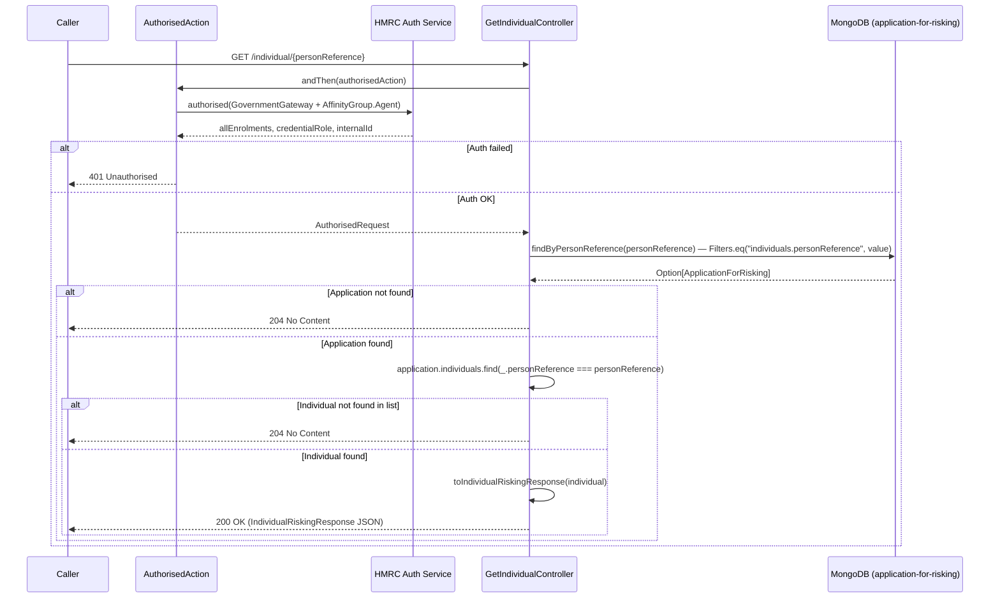

# ARR03 — Get Individual Risking Response

## Overview

Retrieves the risking response for a specific individual identified by their person reference. The endpoint searches across all stored applications using the `individuals.personReference` MongoDB index, then extracts the matching individual's status and failure information.

## API Details

| Property | Value |
|---|---|
| **API ID** | ARR03 |
| **Method** | GET |
| **Path** | `/individual/{personReference}` |
| **Controller** | `GetIndividualController` |
| **Controller Method** | `getIndividualRiskingResponse(personReference: PersonReference)` |
| **Audience** | Internal |
| **Authentication** | Government Gateway (Agent, User/Admin credential role) |

## Path Parameters

| Name | Type | Required | Description |
|---|---|---|---|
| `personReference` | string | Yes | The unique person reference for the individual. Bound as `PersonReference` value class. |

## Query Parameters

None.

## Response

### 200 OK

```json
{
  "personReference": "IND001",
  "status": "ReadyForSubmission",
  "failures": null
}
```

**Status values:** `ReadyForSubmission`, `SubmittedForRisking`, `Approved`, `FailedNonFixable`, `FailedFixable`, `ReadyForResubmission`

### 204 No Content

Person reference not found. Empty body.

### 401 Unauthorised

Authentication or authorisation failure.

## Service Architecture

- **`Actions`** — provides the `authorised` action builder.
- **`AuthorisedAction`** — validates Government Gateway auth (Agent affinity group, User/Admin credential role, no active HMRC-AS-AGENT enrolment).
- **`ApplicationForRiskingRepo`** — queries the `application-for-risking` collection using the `individuals.personReference` index.

## Interaction Flow



## Dependencies

| Dependency | Type | Purpose |
|---|---|---|
| HMRC Auth Service | External HTTP | Government Gateway authentication |
| MongoDB (`application-for-risking`) | Database | Read `ApplicationForRisking` documents |

## Database Collections

### `application-for-risking`

- **Operation:** `findOne` (MongoDB `find` with `headOption`)
- **Filter:** `{ "individuals.personReference": "<value>" }`
- **Index used:** `individuals.personReference` (unique index)

## Special Cases

- Returns **204 No Content** (not 404) when the person reference is not found.
- Two-step lookup: MongoDB query returns the parent application, then an in-memory `find` on the `individuals` list retrieves the exact individual.
- The unique index on `individuals.personReference` guarantees at most one application can contain a given personReference.

## Error Handling

| Scenario | Behaviour |
|---|---|
| Auth failure | `401 Unauthorised` |
| Person reference not found | `204 No Content` |
| MongoDB read failure | Future fails; `500 Internal Server Error` |

## Performance Considerations

- Fast O(1) MongoDB lookup via the unique `individuals.personReference` index.
- In-memory `find` on `individuals` list is O(n) where n = number of individuals per application (typically small).

## Notes

- The `personReference` is set to the `IndividualProvidedDetailsId` value at submission time (ARR01).
- Risking failure details at the individual level are populated by the downstream SDES/risking process.

## Document Metadata

| Property | Value |
|---|---|
| **Last Updated** | 2026-03-27 |
| **Git Commit SHA** | `169b806fc80ac3b3ff2f69c831f3dd6627378da0` |
| **Analysis Version** | 1.0 |
