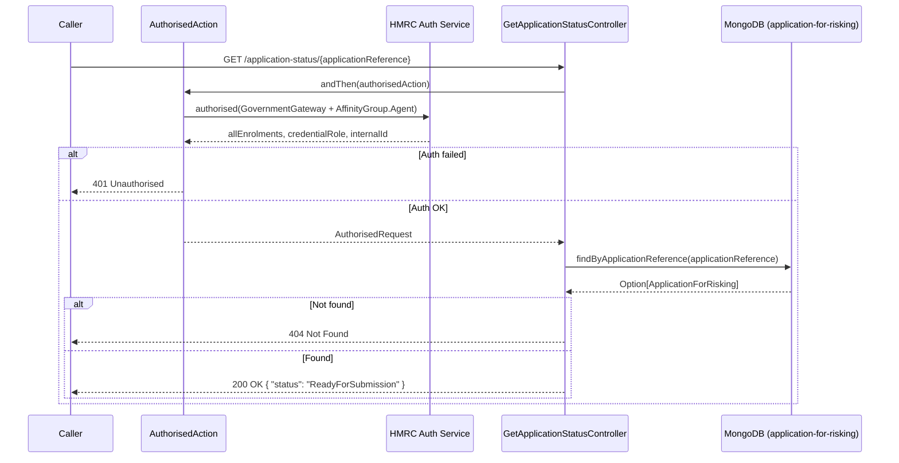

# ARR04 — Get Application Status

## Overview

Retrieves the current risking status for a given application reference. This is a lightweight status-only endpoint — it returns a single `status` field rather than the full risking response. Returns `404 Not Found` if the application reference does not exist (note: unlike ARR02 which returns `204`).

## API Details

| Property | Value |
|---|---|
| **API ID** | ARR04 |
| **Method** | GET |
| **Path** | `/application-status/{applicationReference}` |
| **Controller** | `GetApplicationStatusController` |
| **Controller Method** | `getApplicationStatus(applicationReference: ApplicationReference)` |
| **Audience** | Internal |
| **Authentication** | Government Gateway (Agent, User/Admin credential role) |

## Path Parameters

| Name | Type | Required | Description |
|---|---|---|---|
| `applicationReference` | string | Yes | The unique application reference. Bound as `ApplicationReference` value class. |

## Query Parameters

None.

## Response

### 200 OK

```json
{
  "status": "ReadyForSubmission"
}
```

**Status values:** `ReadyForSubmission`, `SubmittedForRisking`, `Approved`, `FailedNonFixable`, `FailedFixable`, `ReadyForResubmission`

### 404 Not Found

Application reference does not exist in the database. Empty body.

### 401 Unauthorised

Authentication or authorisation failure.

## Service Architecture

- **`Actions`** — provides the `authorised` action builder.
- **`AuthorisedAction`** — validates Government Gateway auth (Agent affinity group, User/Admin credential role, no active HMRC-AS-AGENT enrolment).
- **`ApplicationForRiskingRepo`** — queries the `application-for-risking` collection by `applicationReference`.

## Interaction Flow



## Dependencies

| Dependency | Type | Purpose |
|---|---|---|
| HMRC Auth Service | External HTTP | Government Gateway authentication |
| MongoDB (`application-for-risking`) | Database | Read `ApplicationForRisking` documents |

## Database Collections

### `application-for-risking`

- **Operation:** `findOne` (MongoDB `find` with `headOption`)
- **Filter:** `{ "applicationReference": "<value>" }`

## Special Cases

- Returns **404 Not Found** (not 204) when the application reference is not found. This differs from ARR02 which returns `204` for the same scenario.
- Response body only contains `status` — no individual details or failure information.
- Status value is the enum case name as a plain string.

## Error Handling

| Scenario | Behaviour |
|---|---|
| Auth failure | `401 Unauthorised` |
| Application not found | `404 Not Found` |
| MongoDB read failure | Future fails; `500 Internal Server Error` |

## Performance Considerations

- Lightweight read against the unique `applicationReference` index — minimal data transferred.
- Suitable for high-frequency polling by upstream services checking for status transitions.

## Notes

- This endpoint is typically used for status polling rather than full result retrieval. Callers needing full risking details should use ARR02.
- Note the inconsistency: ARR02 returns `204` for not-found while ARR04 returns `404`.

## Document Metadata

| Property | Value |
|---|---|
| **Last Updated** | 2026-03-27 |
| **Git Commit SHA** | `169b806fc80ac3b3ff2f69c831f3dd6627378da0` |
| **Analysis Version** | 1.0 |
