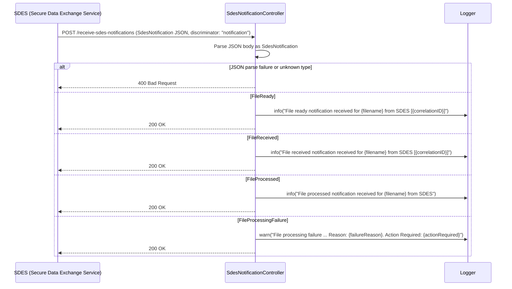

# ARR05 — Receive SDES Notifications

## Overview

Receives and processes inbound file notification callbacks from SDES (Secure Data Exchange Service). SDES calls this endpoint to notify the service about the lifecycle of risking files that were previously uploaded to Object Store. The endpoint acknowledges all notification types with `200 OK` after logging the event. No database writes are performed — this is a pure log-and-acknowledge pattern.

## API Details

| Property | Value |
|---|---|
| **API ID** | ARR05 |
| **Method** | POST |
| **Path** | `/receive-sdes-notifications` |
| **Controller** | `SdesNotificationController` |
| **Controller Method** | `receiveSdesNotification` |
| **Audience** | Internal |
| **Authentication** | **None** — inbound SDES callback, no Government Gateway auth |

## Path Parameters

None.

## Query Parameters

None.

## Request Body

Content-Type: `application/json`

The body must be a valid `SdesNotification` JSON object. The notification type is determined by the `notification` discriminator field:

### FileReady

```json
{
  "notification": "FileReady",
  "filename": "asa_risking_file_version1_0_4_20260327_112012.txt",
  "correlationID": "abc-123",
  "availableUntil": "2026-04-03T11:20:12Z",
  "dateTime": "2026-03-27T11:20:12Z"
}
```

### FileReceived

```json
{
  "notification": "FileReceived",
  "filename": "asa_risking_file_version1_0_4_20260327_112012.txt",
  "correlationID": "abc-123",
  "dateTime": "2026-03-27T11:20:12Z"
}
```

### FileProcessed

```json
{
  "notification": "FileProcessed",
  "filename": "asa_risking_file_version1_0_4_20260327_112012.txt",
  "correlationID": "abc-123",
  "dateTime": "2026-03-27T11:20:12Z"
}
```

### FileProcessingFailure

```json
{
  "notification": "FileProcessingFailure",
  "filename": "asa_risking_file_version1_0_4_20260327_112012.txt",
  "correlationID": "abc-123",
  "dateTime": "2026-03-27T11:20:12Z",
  "failureReason": "Malformed record",
  "actionRequired": "Manual investigation required"
}
```

## Response

| Status | Description |
|---|---|
| `200 OK` | All notification types return 200. Empty body. |
| `400 Bad Request` | JSON body failed to parse or contains an unknown `notification` discriminator value. |

## Service Architecture

- **`SdesNotificationController`** — handles the endpoint directly using `Action.apply` (no auth action builder).
- No repository or service layer interaction.
- Logging only.

## Interaction Flow



## Dependencies

None. This endpoint has no external HTTP calls or database interactions.

## Database Collections

None.

## Special Cases

- **No authentication** — this endpoint is designed to receive callbacks from SDES and does not enforce Government Gateway auth.
- **FileProcessingFailure always returns 200** — failures are logged as warnings but no automated remediation is triggered. Manual investigation is required when `actionRequired` is populated.
- **Discriminator field** — the JSON `notification` field determines the notification type. The value must exactly match one of: `FileReady`, `FileReceived`, `FileProcessed`, `FileProcessingFailure`.
- The `correlationID` field in `FileReady` and `FileReceived` is logged to aid in tracing SDES interactions in log aggregation tools (e.g., Kibana).

## Error Handling

| Scenario | Behaviour |
|---|---|
| Unknown notification type discriminator | `400 Bad Request` (JSON parse failure) |
| Malformed JSON body | `400 Bad Request` |
| FileProcessingFailure notification | `200 OK` + warning log (no automated action) |

## Performance Considerations

- Synchronous endpoint with no I/O — purely logging. Expected to be very fast.
- No rate limiting is currently implemented.

## Notes

- SDES calls this endpoint as part of the file lifecycle: `FileReady` → `FileReceived` → `FileProcessed` (or `FileProcessingFailure`).
- The `FileReady` notification indicates SDES has the file available for processing. `FileProcessed` indicates successful processing by SDES/risking system.
- Currently, no status updates to the `application-for-risking` collection are triggered by these notifications — the risking outcome is expected to flow back via a separate mechanism.
- `FileProcessingFailure` contains `actionRequired` which may indicate manual intervention is needed. Monitoring/alerting on warning logs for this scenario is recommended.

## Document Metadata

| Property | Value |
|---|---|
| **Last Updated** | 2026-03-27 |
| **Git Commit SHA** | `169b806fc80ac3b3ff2f69c831f3dd6627378da0` |
| **Analysis Version** | 1.0 |
